# Stock / Crypto Analysis Agent

A multi-step LLM agent that produces a structured investment analysis report for any public stock, ETF, or cryptocurrency. The agent uses the [Groq](https://groq.com) API with `llama-3.3-70b-versatile` to process market data, compute technical indicators, and analyze news sentiment through a sequential reasoning chain.

---

## Agent Workflow

The agent works through a series of sequential steps—from data ingestion and technical analysis to adversarial critique—to arrive at a final recommendation.



---

## Inputs the Agent Handles

The agent is designed to resolve various types of user input into actionable market data queries:

-   **Stock Tickers**: `AAPL`, `NVDA`, `TSLA`, `SPY`, etc.
-   **Cryptocurrencies**: `Bitcoin`, `ETH`, `Solana`, `BTC`, etc.
-   **Natural Language**: `"Should I buy Apple?"`, `"Analyze gold ETF"`, `"What do you think about BTC short term?"` — The agent automatically resolves these to their canonical tickers.

---

## Tools & Data Sources

The agent integrates several external and internal tools to ensure data accuracy and depth:

-   **Yahoo Finance API**: Fetches real-time price and historical chart data for stocks and ETFs.
-   **CoinGecko API**: Retrieves market data and OHLC series for cryptocurrencies.
-   **Google News RSS**: Gathers recent headlines (last 14 days) for sentiment analysis.
-   **Technical Analysis Engine**: A pure-Python tool that computes RSI, MACD, Bollinger Bands, and Moving Averages without relying on LLM arithmetic.

---

## Setup & Installation

**1. Install Requirements**

The project uses only the Python standard library. You can ensure your environment is ready by running:

```bash
pip install -r requirements.txt
```

## Running the Agent

### Quick Run (One-off)
For a quick analysis without setting up environment variables, pass your Groq API key directly as a CLI flag:
```bash
python main.py "Should I buy Bitcoin?" --api-key YOUR_GROQ_API_KEY
```

### Persistent Usage (Ideal)
For regular use, it is better to export the API key to your environment so you don't have to provide it every time:
```bash
# Export the key
export GROQ_API_KEY="gsk_your_key_here"

# Run the agent normally
python main.py "Analyze AAPL"
```

### Advanced Examples
You can combine different flags to customize the analysis depth and output:
```bash
# Verbose analysis of NVDA with 10 news headlines
python main.py "Analyze NVDA" --verbose --news-limit 10

# Analyze a crypto asset and save results to a specific directory
python main.py "What do you think about ETH?" --output-dir my_crypto_reports
```

### Configuration Flags

| Flag | Default | Description |
|------|---------|-------------|
| `--api-key` | `None` | Groq API key (overrides environment variable) |
| `--output-dir` | `outputs/` | Directory where report files will be saved |
| `--news-limit` | `6` | Number of news headlines to fetch for sentiment analysis |
| `--verbose` | `off` | Print detailed step-by-step trace to the terminal |

---

## Outputs

After every run, the agent writes the following files to the `outputs/` folder:

-   **`report_<TICKER>_<TIMESTAMP>.md`**: A human-readable Markdown report with the final recommendation.
-   **`report_<TICKER>_<TIMESTAMP>.json`**: A structured JSON file containing all final data fields.
-   **`trace_<TICKER>_<TIMESTAMP>.json`**: A full execution log including every step's input, output, and LLM metadata.

Sample outputs are already available in the `outputs/` folder, and all new results will be saved there by default.
